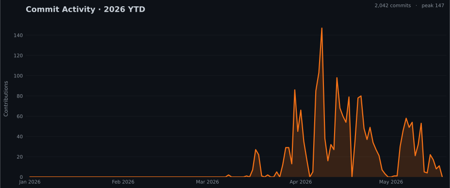

# Sebastian Breguel

**AI Researcher @ [Vambe AI](https://vambe.ai)** · MSc Computer Science, PUC Chile

Building things at the intersection of ML, math, and curiosity.

<h4> ML, Math and Psychology enthusiast </h4>

- 🔭 I've worked on the assistantships on different courses
- 🌱 MSc Computer Science @ PUC Chile
- 🧠 Currently researching AI @ Vambe AI

---

  

  

